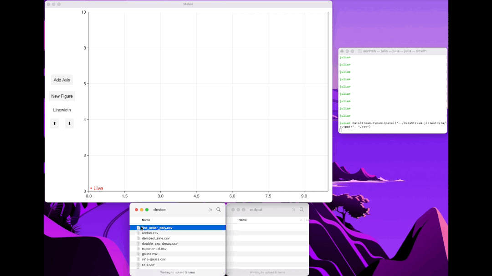

# DataStream.jl

A very simple proof-of-concept GUI that automatically displays new data added to a folder using GLMakie. The intended use case is an experimental device that takes measurements and saves the data to a file. This program will watch a folder using `FileWatching` (part of the standard Julia library) and update `Observable`s for the data and the menu items. The menu is used to select previously saved data.

Another package of mine, LVM.jl, is a dependency. This reads LabView files (and also .csv files) particular to my experiment.

Hopefully this is a nice example for others to build their own GUIs for experimental data collection.

