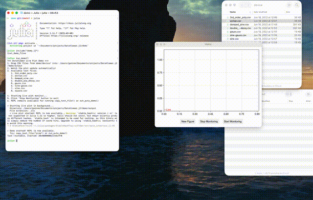

# DataViewer.jl

A real-time data visualization tool that automatically displays new data files added to a folder using GLMakie. The intended use case is experimental devices that save measurements to files, providing live plotting capabilities for immediate data inspection.

This program watches a folder using `FileWatching` and updates `Observable`s for live data visualization. Features include:
- Live plotting with automatic updates when new files appear
- Start/stop monitoring controls
- Satellite panels for detailed data inspection
- File selection menus for viewing historical data
- Non-blocking operation (REPL remains available)

Another package of mine, LVM.jl, is a dependency for reading LabView files and CSV files specific to experimental setups.

## Quick Demo

```julia
# Load the demo
include("demo/demo.jl")

# Start live monitoring (non-blocking)
run_demo()

# Copy test files to see live updates
copy_test_file("sine")
copy_test_file("gauss")

# Or run automatic demo
run_auto_demo()
```

## Basic Usage

```julia
using DataViewer

# Start live plotting (async by default, REPL stays available)
task = live_plot("path/to/data/folder")

# For blocking behavior
live_plot("path/to/data/folder", async=false)

# With custom file type and loading function
live_plot("path/to/data", load_test_data, ".csv")
```


